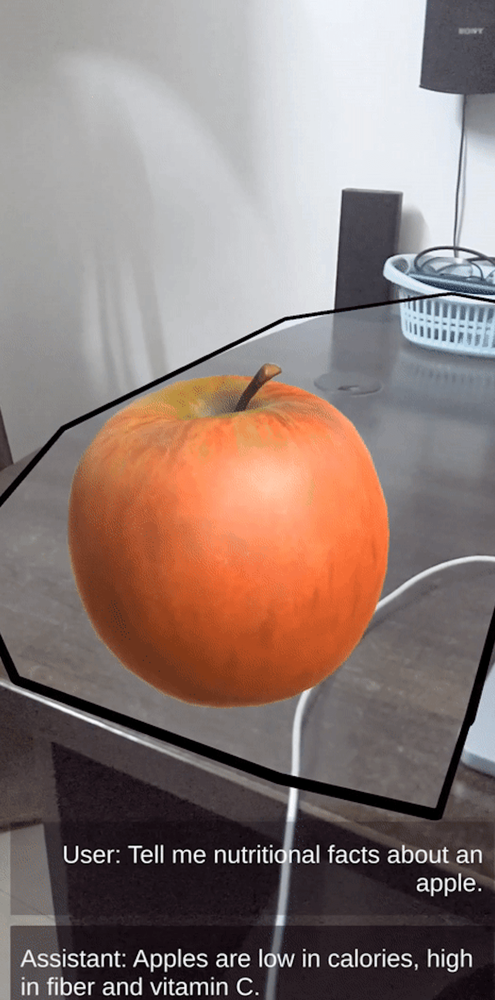

# Cognixion Assignment

## Usage instructions
1. Download and Open in Unity 2022.3.(13+)f1 version. I used 2022.3.13f1 with ARFoundation 5.0.7.
2. Can be built for iOS / Android, use in Portrait mode only.
3. Scan surroundings to get planes.
4. Tap on the screen to add a 3D model of an Apple on any plane. (This would represent a real apple kept on a table.)
5. Tap anywhere else except the Apple's model to move the Apple to the new location on a plane.
6. Tap on Apple to get nutritional facts about it.

Animation info: The idea behind the glow animation is to present a delightful experience to the user for the visual context of the selected object of interest (we can achieve this by Segment Anything models), making perceived loading time shorter and would ideally be a voice activation action where in user can ask "What are its nutritional benefits?" and the animation would respond to microphone levels for providing the perception as if the object is listening to the user.
   

## Interaction prototype ideas based on alternate ideas
1. I believe the interaction would be very different in a smart glass as compared to a smartphone, rather than tapping on the screen, we would need to think of and prototype other interaction techniques 
such as:
  - eye gaze with a tap on glasses
  - eye gaze and asking a question about the object while touching the smart glass or a controller for voice activation.
  - touching the object in the real world and asking a question about it. (without referencing the question directly, for eg. touching a fruit and asking if it's ripe based on the color. In this scenario, the user would want to know the answers even if they don't know the name of the fruit itself. Touching of the object could be detected using a highly accurate near depth sensor for hands.

## Assumptions for this assignment
1. This prototype was aimed to visualize how an interaction with a real-world object could look like with ChatGPT responses to help understand the object.
2. I wanted to use voice interactions as they would be more natural and get responses as speech output as well but have restricted to a chat-based scroll view.
